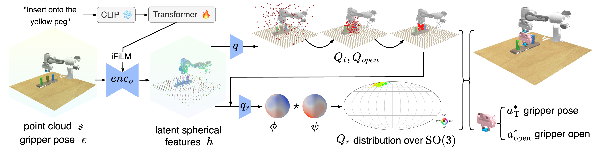

# [ICLR2026] EquAct: An SE(3)-Equivariant Multi-Task Transformer for 3D Robotic Manipulation

Xupeng Zhu, Yu Qi, Yizhe Zhu, Robin Walters, Robert Platt.

[OpenReview](https://openreview.net/pdf?id=d1wuA8oIH0) |
[7min Video](https://www.youtube.com/watch?v=ymrNQusB6Mw)



Multi-task manipulation policy often builds on transformer's ability to jointly process language instructions and 3D observations in a shared embedding space. However, real-world tasks frequently require robots to generalize to novel 3D object poses. Policies based on shared embedding break geometric consistency and struggle in 3D generation. To address this issue, we propose EquAct, which is theoretically guaranteed to generalize to novel 3D scene transformations by leveraging $\mathrm{SE}(3)$ equivariance shared across both language, observations, and action. EquAct makes two key contributions: (1) an efficient $\mathrm{SE}(3)$-equivariant point cloud-based U-net with spherical Fourier features for policy reasoning, and (2) $\mathrm{SE}(3)$-invariant Feature-wise Linear Modulation (iFiLM) layers for language conditioning. Finally, EquAct demonstrates strong spatial generalization ability and achieves state-of-the-art across $18$ RLBench tasks with both $\mathrm{SE}(3)$ and $\mathrm{SE}(2)$ scene perturbations, different amounts of training data, and on $4$ physical tasks.


## Installation
Create a conda environment with the following command:
We recommend Mambaforge instead of the standard anaconda distribution for faster installation:
https://github.com/conda-forge/miniforge#mambaforge

```
# initiate conda env
> conda update conda
> mamba env create -f equiformerv2_env.yaml
> mamba env update -f 3dda_env.yaml
> conda activate equ_act

# install dgl (https://www.dgl.ai/pages/start.html)
>  pip install dgl==1.1.3+cu116 -f https://data.dgl.ai/wheels/cu116/dgl-1.1.3%2Bcu116-cp38-cp38-manylinux1_x86_64.whl
```

Install RLBench locally
```
# Install open3D
> pip install open3d

> mkdir CoppeliaSim; 
> cd CoppeliaSim/
> wget https://www.coppeliarobotics.com/files/V4_1_0/CoppeliaSim_Edu_V4_1_0_Ubuntu20_04.tar.xz
> tar -xf CoppeliaSim_Edu_V4_1_0_Ubuntu20_04.tar.xz;
> echo "export COPPELIASIM_ROOT=$(pwd)/PyRep/CoppeliaSim_Edu_V4_1_0_Ubuntu20_04" >> $HOME/.bashrc; 
> echo "export LD_LIBRARY_PATH=\$LD_LIBRARY_PATH:\$COPPELIASIM_ROOT" >> $HOME/.bashrc;
> echo "export QT_QPA_PLATFORM_PLUGIN_PATH=\$COPPELIASIM_ROOT" >> $HOME/.bashrc;
> source $HOME/.bashrc;
# Install PyRep (https://github.com/stepjam/PyRep?tab=readme-ov-file#install)
> git clone https://github.com/stepjam/PyRep.git;
> pip install -r requirements.txt; pip install -e .; cd ..

# Install RLBench (Note: there are different forks of RLBench)
# PerAct setup
> git clone https://github.com/MohitShridhar/RLBench.git
> cd RLBench; git checkout -b peract --track origin/peract; pip install -r requirements.txt; pip install -e .; cd ..;
```

Remember to modify the success condition of `close_jar` task in RLBench, as the original condition is incorrect.  See this [pull request](https://github.com/MohitShridhar/RLBench/pull/1) for more detail.  

### Data Preparation

See [Preparing RLBench dataset](./docs/DATA_PREPARATION_RLBENCH.md).


## Training:
EquAct:
```bash
bash ./scripts/train_equact_peract.sh
```

## Testing:
EquAct:
First, donwload the weights and put under `train_logs/`

```bash
bash ./online_evaluation_rlbench/server_eval_equact_peract.sh
```


# Citation
If you find this code useful for your research, please consider citing our paper ["EquAct: An SE(3)-Equivariant Multi-Task Transformer for 3D Robotic Manipulation"](https://openreview.net/forum?id=d1wuA8oIH0&referrer=%5BAuthor%20Console%5D(%2Fgroup%3Fid%3DICLR.cc%2F2026%2FConference%2FAuthors%23your-submissions)).
```
@inproceedings{
zhu2026equact,
title={EquAct: An {SE}(3)-Equivariant Multi-Task Transformer for 3D Robotic Manipulation},
author={Xupeng Zhu and Yu Qi and Yizhe Zhu and Robin Walters and Robert Platt},
booktitle={The Fourteenth International Conference on Learning Representations},
year={2026},
url={https://openreview.net/forum?id=d1wuA8oIH0}
}
```

# License
This code base is released under the MIT License (refer to the LICENSE file for details).

# Acknowledgement
Parts of this codebase have been adapted from:

[EquiformerV2](https://github.com/atomicarchitects/equiformer_v2)

[Spherical Diffusion Policy](https://github.com/amazon-science/Spherical_Diffusion_Policy)

[Image to Sphere](https://github.com/dmklee/image2sphere)

[OrbitGrasp](https://github.com/BoceHu/orbitgrasp)

[3D Diffuser Actor](https://github.com/nickgkan/3d_diffuser_actor)

[Act3D](https://github.com/zhouxian/act3d-chained-diffuser)

